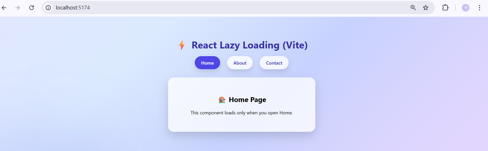
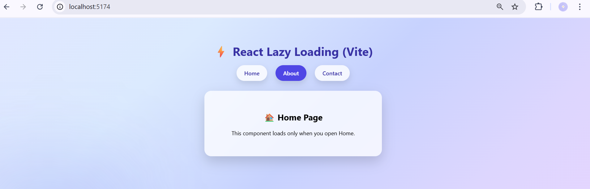
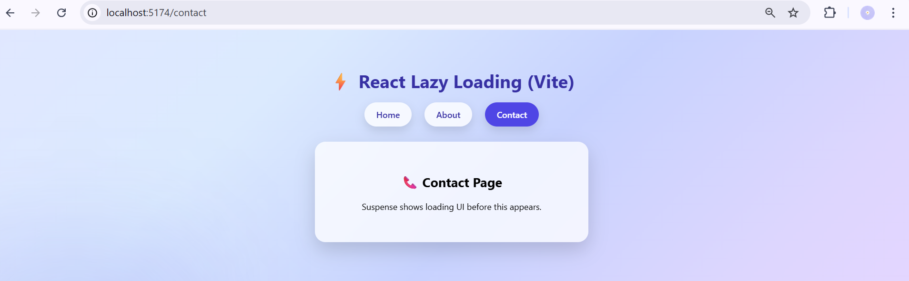

# 🚀 Lazy Loading UI – React Performance Optimization

This project demonstrates **frontend performance optimization using Lazy Loading** in a React Single Page Application (SPA).

It uses **React.lazy()** and **Suspense** to dynamically load components only when required, improving page load speed and reducing initial bundle size.

---

## 🎯 Aim

To optimize frontend performance by implementing **lazy loading of components** in a Single Page Application using:

- React.lazy()
- Suspense

---

## 🛠️ Tech Stack

- React (Vite)
- React Router DOM
- JavaScript
- CSS
- Node.js

---

## ⚡ Features

✅ Component Lazy Loading  
✅ Dynamic Routing  
✅ Suspense Loading Fallback UI  
✅ Faster Initial Page Load  
✅ Clean Modern UI  

---

## 📂 Project Structure

```
lazy-loading-ui/
│
├── public/
├── src/
│   ├── assets/
│   ├── components/
│   ├── App.jsx
│   ├── main.jsx
│   └── App.css
│
├── photos/
│   ├── HOME_UI.png
│   ├── ABOUT_UI.png
│   └── CONTACT_UI.png
│
├── package.json
└── vite.config.js
```

---

## ▶️ How to Run the Project

### 1️⃣ Clone Repository
```bash
git clone https://github.com/Shivi714/Full-Stack-EXP-5.git
```

### 2️⃣ Go to Project Folder
```bash
cd Full-Stack-EXP-5
```

### 3️⃣ Install Dependencies
```bash
npm install
```

### 4️⃣ Run Development Server
```bash
npm run dev
```

Open browser → http://localhost:5173

---

## 🧠 Theory (Lazy Loading)

Lazy loading is a performance optimization technique where components are loaded **only when needed**.

In React:

- `React.lazy()` → loads components dynamically
- `Suspense` → shows fallback UI while loading

This reduces:

✔ Initial bundle size  
✔ Loading time  
✔ Resource usage  

---

## 📸 UI Screenshots

### 🏠 Home Page UI


---

### ℹ️ About Page UI


---

### 📞 Contact Page UI


---

## 📈 Performance Benefits

- Faster navigation
- Reduced initial load time
- Efficient component rendering
- Better user experience

---

## 👩‍💻 Author

**Shivali**

GitHub: https://github.com/Shivi714

---

## ⭐ If you like this project

Give it a ⭐ on GitHub!
